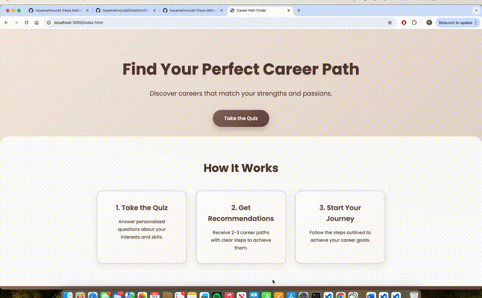

# CareerPathFinder AI 

A personalized career recommendation web application that uses Google's Gemini AI (2.5 Model) to suggest tailored career paths based on user responses to an intelligent, adaptive quiz.

## How It Works

### 1. Initial Assessment
Users answer a primary question about their core interests (working with people, solving technical problems, or organizing).

### 2. Adaptive Follow-ups
Based on the initial answer, the quiz presents relevant follow-up questions:
- **Working with people** → Speaking to audiences? One-on-one counseling? Team leadership?
- **Technical problems** → Software development? Data analysis? Mechanical engineering?
- **Organizing** → Project management? Financial planning? Event coordination?

### 3. AI Analysis
All responses are sent to Google Gemini AI, which analyzes the profile and generates:
- A personalized summary
- 2-3 highly specific career recommendations
- Detailed steps to achieve each career path

## Running

### Prerequisites

- Node.js (v14 or higher)
- npm or yarn
- Google Gemini API key

## Technologies Used

- **Frontend**: HTML5, CSS3, Vanilla JavaScript
- **Backend**: Node.js, Express.js
- **AI**: Google Gemini 2.5 Flash API
- **Styling**: Custom CSS with gradients and animations
- **Font**: Google Fonts (Poppins)
